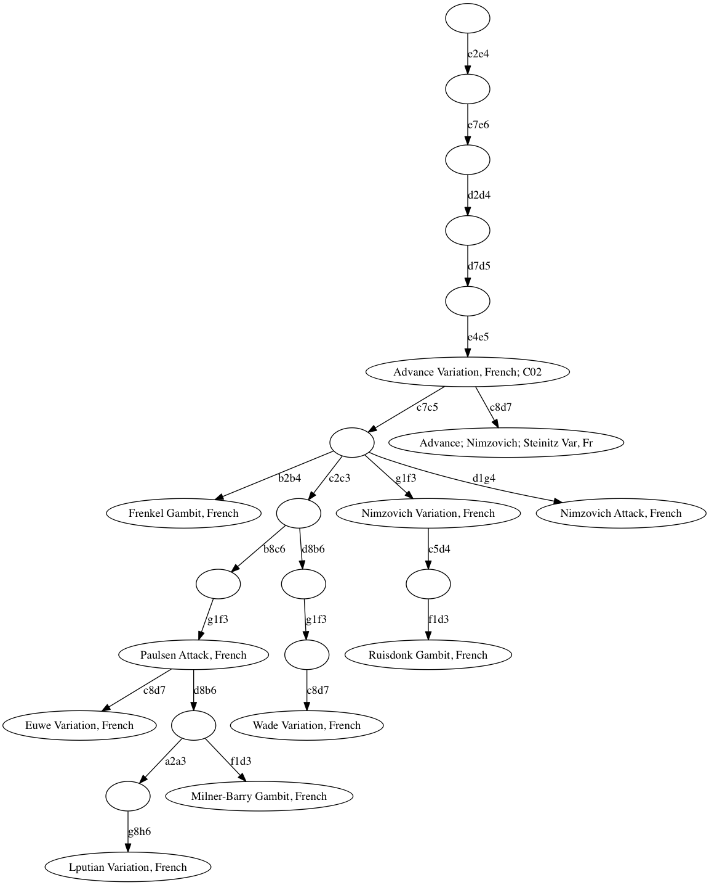

# opening

**opening** provides interactivity to opening books such as [Encyclopaedia of Chess Openings](https://en.wikipedia.org/wiki/Encyclopaedia_of_Chess_Openings) (ECO) which is loadable from the package.  Source: https://github.com/lichess-org/chess-openings

## Visual

Advance Variation subtree of the French Defense:



## Example

```go   
package main

import (
    "fmt"

    "github.com/lavren1974/chess960"
    "github.com/lavren1974/chess960/opening"
)

func main(){
    g := chess.NewGame()
	g.MoveStr("e4")
	g.MoveStr("e6")

	// print French Defense
	book := opening.NewBookECO()
	o := book.Find(g.Moves())
	fmt.Println(o.Title())
}
```